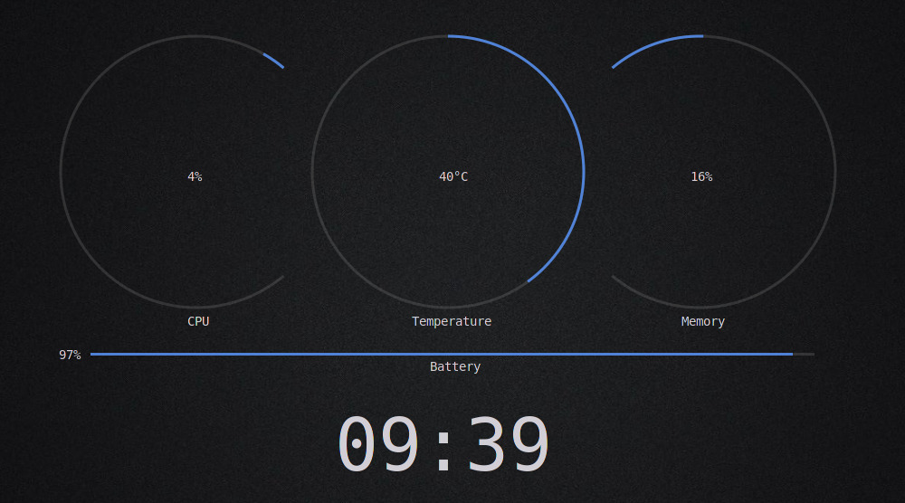

# Namoudaj Conky

Namoudaj is a Boilerplate and a template with a lot of abstractions that makes Conky scripting easy and fast with Lua and Cairo.



This theme was created with this function only (see `start.lua`):

```lua
function start()
    local rings_radius = 150
    local thickness = 3

    ring_anticlockwise(277, 200, rings_radius, thickness, 400, 140, cpu_percent(), 100, color_frompercent(tonumber(cpu_percent())))   -- cpu ring
    ring_clockwise(555, 200, rings_radius, thickness, 0, 360, cpu_temperature(), 100, main_fg)     -- temperature ring
    ring_clockwise(833, 200, rings_radius, thickness, -40, 220, memory_percent(), 100, main_fg)    -- ram ring

    if has_battery then
        rectangle_leftright(160, 400, 800, thickness, battery_percent(), 100, color_frompercent_reverse(tonumber(battery_percent())))   -- battery rectangle / line
        write(535, 400+20, "Battery", 14, main_text_color)
        write(125, 407, battery_percent() .. "%", 14, main_text_color)
    end

    -- titles
    write(267, 200+rings_radius+20, "CPU", 14, main_text_color)
    write(515, 200+rings_radius+20, "Temperature", 14, main_text_color)
    write(813, 200+rings_radius+20, "Memory", 14, main_text_color)

    -- text values
    write(267, 210, cpu_percent() .. "%", 14, main_text_color)
    write(545, 210, cpu_temperature() .. "°C", 14, main_text_color)
    write(823, 210, memory_percent() .. "%", 14, main_text_color)

    -- clock
    write(430, 530, time_hrmin(), 80, main_text_color)
end
```

### HOWTO

All the functions you need are inside `abstract.lua`. another important file is `settings.lua` that defines constants likes the used color scheme, network interface, internet speed...

To make your own conky theme, edit `start.lua` and put your instructions inside the `start()` function. Once your code is complete, you can launch it by calling conky on the file `conkyrc` like this:
```sh
conky -c conkyrc
```

## Features

- fast programming by accessing a bunch of ready functions that makes the formatting for you. and this makes your code cleaner and readable.
- 10+ available color schemes for light and dark themes. You can select one by changing the variable `THEME` in `settings.lua`

### Dependencies

- Conky 1.10+
- cairo
- imlib2


### Conky Themes made from Namoudaj

- [Auzia](https://www.github.com/SZinedine/auzia-conky)

